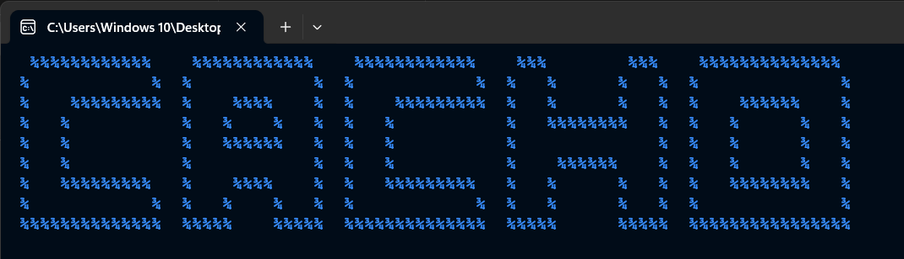
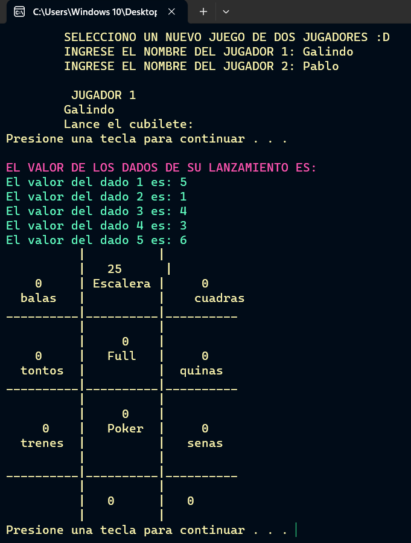
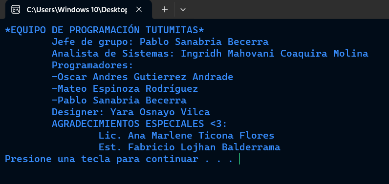

# Cacho - Juego de Dados en C++

## Descripción
Cacho es un juego boliviano de dados, este proyecto lo simula en C++. El juego se ejecuta en la terminal y permite a dos jugadores competir lanzando dados para obtener la mejor puntuación.

## Características
- Dos jugadores pueden participar.
- Interfaz basada en la terminal.
- Uso de dados y reglas del juego Cacho.

## Instrucciones de Uso
1. Compila el código utilizando un compilador de C++.
2. Ejecuta el programa en la terminal.
3. Sigue las instrucciones para jugar y disfrutar del juego.

## Dependencias
El juego utiliza las bibliotecas estándar de C++ y puede requerir ajustes según el entorno de desarrollo.

## Imagenes

    
    

## Licencia
Este proyecto está bajo la Licencia MIT. Consulta el archivo [LICENSE](LICENSE) para obtener más detalles.

---

¡Diviértete jugando Cacho!
